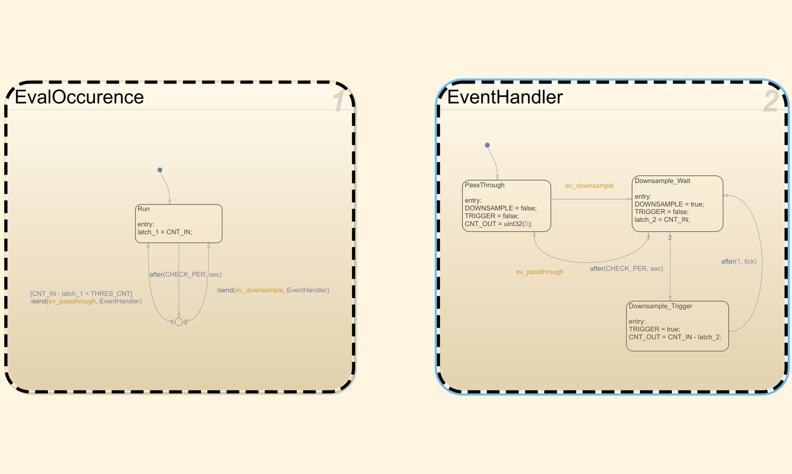
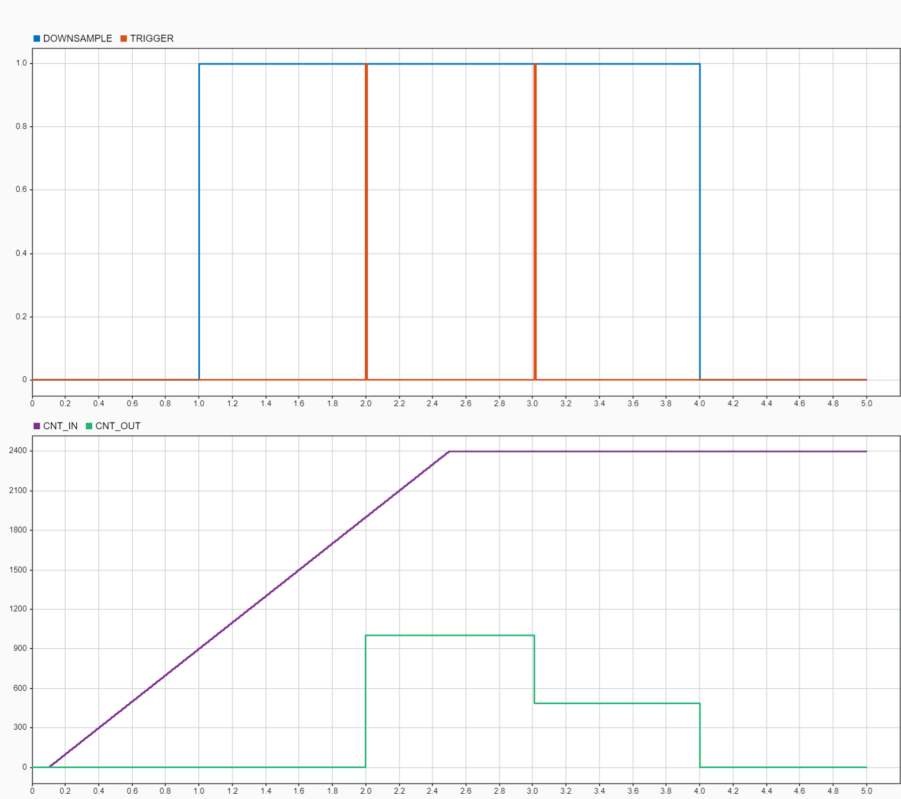

Event Downsampler
=================



The FSM receives as input a boolean that is `1` when an event is being triggered and `0` otherwise and
yields as output a corresponding boolean with the same meaning that undergoes however a sort of smart down-sampling
plus a counter that tells us how many original events have been raised in a given temporal window.

The handler is composed of two parallel charts:

- `EvalOccurence` is devoted to evaluating the number of events triggered in a given temporal window (default = 1 sec).
- `EventHandler` is the actual handler implementing the logic below:
  - If the occurrence of the events is above a threshold, then it triggers the output only each second (i.e., same lapse as above).
  - Otherwise, output = input.

We have only 2 params:
- The temporal window is used to evaluate the frequency of the input events and to carry out down-sampling at the output stage.
- The threshold for the events detected in the window above which triggers down-sampling (default = 5).

The output of the handler is threefold:
- The boolean `DOWNSAMPLE` that is `1` when the handler is downsampling the input events. 
- The boolean `OUT` that tells when to print the message.
- The integer `CNT` that accounts for the number of events that occurred since the last print (this info can be used to populate the message).

Here's below a typical outcome where it's shown how the output follows the input only within the initial window that serves to evaluate
the occurrence of the events. After that, the output gets triggered only in single instances.



Find below a meta-code that can be used to interface the handler for managing the occurrence of multiple event types:

```c++
IN = false;

if (event_1) {
  IN = true;
  if (!FSM.DOWNSAMPLE) {
    yInfo() << "event 1 occurred";
  }
}

if (event_2) {
  IN = true;
  if (!FSM.DOWNSAMPLE) {
    yInfo() << "event 2 occurred";
  }
}

// ...

FSM_step(IN);

if (FSM.DOWNSAMPLE && FSM.OUT) {
  yInfo() << "Detected <<" FSM.CNT << "events on aggregate since the last message";
}
```

### References
This model has been developed to address https://github.com/robotology/icub-main/issues/768.
